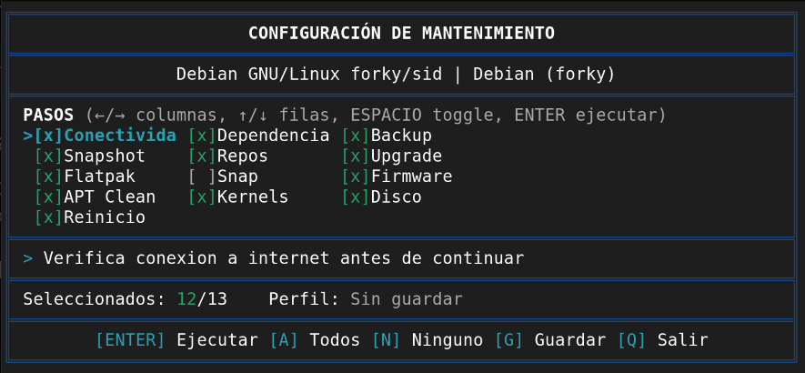
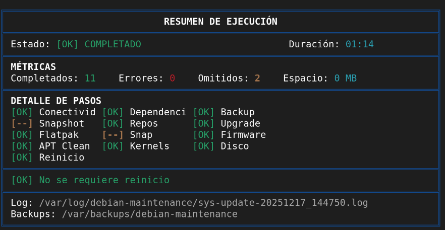
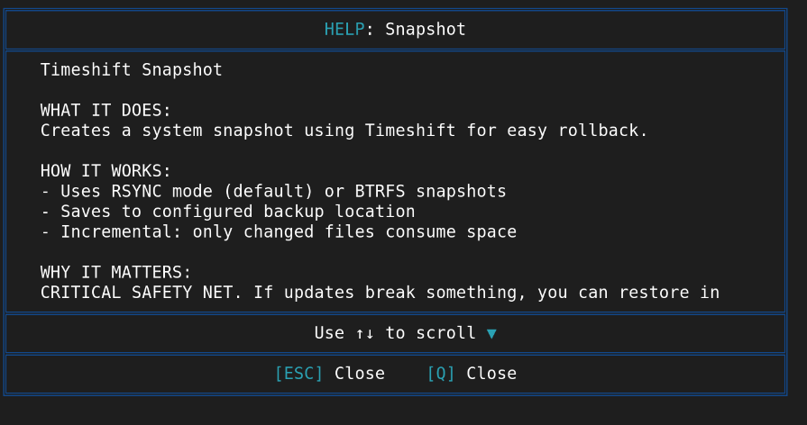
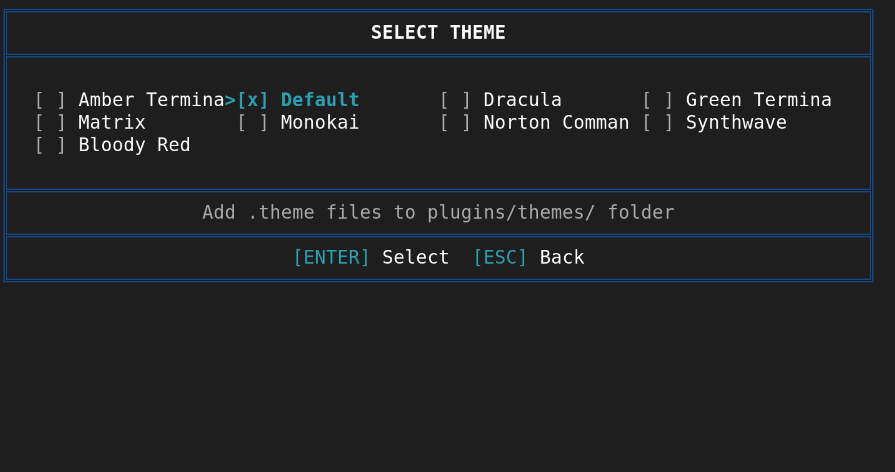
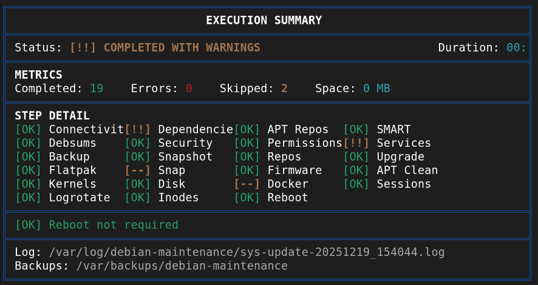
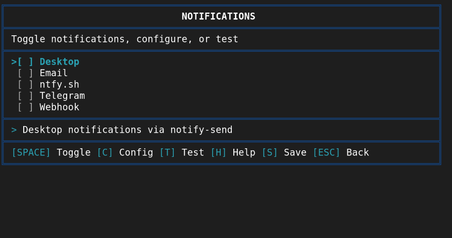
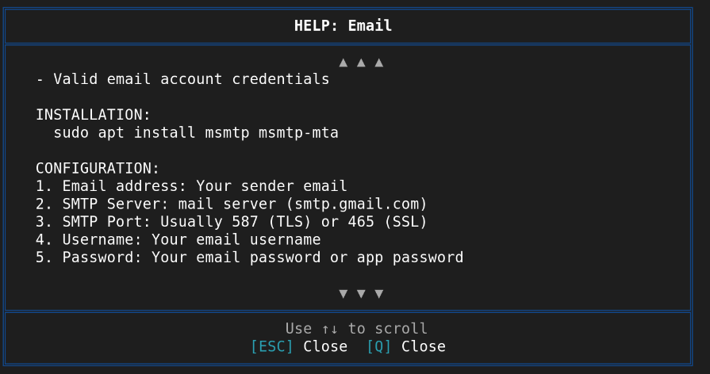
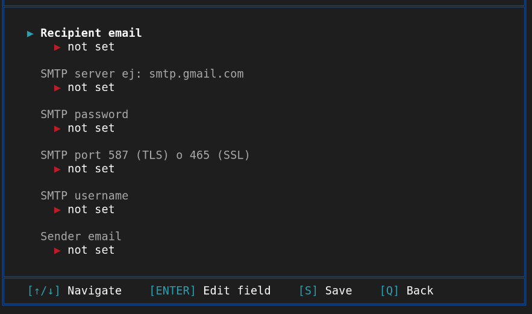

# Debian Scripts Collection

[](https://github.com/vdirienzo/DebianScripts/stargazers)
[](https://github.com/vdirienzo/DebianScripts/network)
[](https://github.com/vdirienzo/DebianScripts/issues)
[](https://opensource.org/licenses/MIT)
[](https://www.gnu.org/software/bash/)
[](https://github.com/vdirienzo/DebianScripts/graphs/commit-activity)

Collection of maintenance and update scripts for Debian/Ubuntu based distributions.

## Table of Contents

- [Available Scripts](#available-scripts)
- [autoclean.sh - Main Script](#autocleansh---main-script)
  - [Supported Distributions](#supported-distributions)
  - [Key Features](#key-features)
  - [System Requirements](#system-requirements)
  - [Installation and Usage](#installation-and-usage)
  - [Advanced Configuration](#advanced-configuration)
  - [Step Locking](#step-locking)
  - [Notifier Locking](#notifier-locking)
  - [Predefined Profiles](#predefined-profiles)
  - [Screenshots](#screenshots)
  - [Interactive Menu](#interactive-menu)
  - [Usage Examples](#usage-examples)
- [Troubleshooting](#troubleshooting)
- [Contributing](#contributing)

---

## Available Scripts

### autoclean.sh - Main Script

**Version:** 2025.12
**Last Revision:** December 2025
**Author:** Homero Thompson del Lago del Terror
**UI/UX Contributions:** Dreadblitz

Comprehensive maintenance script for Debian/Ubuntu based distributions with emphasis on security, granular control, **automatic distribution detection**, and **enterprise-grade interactive configuration menu**.

---

## Supported Distributions

The script automatically detects and supports the following distributions:

| Distribution | Family | Verification Mirror |
|--------------|--------|---------------------|
| **Debian** (Stable, Testing, Unstable) | debian | deb.debian.org |
| **Ubuntu** (all LTS and regular versions) | ubuntu | archive.ubuntu.com |
| **Linux Mint** (all versions) | mint | packages.linuxmint.com |
| **Pop!_OS** | ubuntu | apt.pop-os.org |
| **Elementary OS** | ubuntu | packages.elementary.io |
| **Zorin OS** | ubuntu | packages.zorinos.com |
| **Kali Linux** | debian | http.kali.org |
| **Other derivatives** | auto-detected | based on ID_LIKE |

Detection is performed automatically using `/etc/os-release` and the script adapts:
- Connectivity verification server
- Behavior based on distribution family
- Messages displayed to the user

---

## Key Features

### User Interface

- **100% ASCII Enterprise Interface**: Emoji-free UI for full compatibility with any terminal
- **4-column interactive menu**: 4x6 grid with all 23 steps, navigation with arrow keys ←/→/↑/↓
- **3-column execution summary**: Compact final report with status of each step
- **Robust alignment with absolute cursor**: Uses ANSI sequences `\033[78G` for perfect borders
- **Pure ASCII icons**: `[OK]`, `[XX]`, `[--]`, `[!!]`, `[..]` for perfect alignment
- **Persistent configuration**: Saves your preferred configuration in `autoclean.conf`
- **Real-time description**: Contextual help for each step while navigating

### Multi-Language (i18n)

- **6 languages supported**: English (en), Spanish (es), Portuguese (pt), French (fr), German (de), Italian (it)
- **Dynamic language detection**: Languages are automatically detected from the `plugins/lang/` folder
- **4-column grid selector**: Press `[L]` in menu, navigate with arrow keys ←/→/↑/↓
- **Create your own language**: Tutorial included in `plugins/lang/TUTORIAL.md`
- **Automatic system detection**: Detects system language and applies it automatically
- **Localized confirmation patterns**: S/N, Y/N, O/N, J/N depending on language
- **--lang parameter**: Force a specific language from command line
- **Persistent configuration**: Selected language is saved in `autoclean.conf`

### Color Themes

- **16 themes included**: Wide variety of visual styles
- **Dynamic detection**: Themes are automatically detected from the `plugins/themes/` folder
- **4-column grid selector**: Press `[T]` in menu, navigate with arrow keys
- **Create your own theme**: Tutorial included in `plugins/themes/TUTORIAL.md`
- **Persistent configuration**: Selected theme is saved in `autoclean.conf`

### Multi-channel Notification System

- **Plugin architecture**: Notifiers are dynamically loaded from `plugins/notifiers/`
- **Included notifiers**: Desktop (notify-send), Telegram Bot API, ntfy.sh, Webhook (Slack/Discord/Teams), Email SMTP
- **Dedicated menu**: Press `[O]` in main menu to manage notifications
- **Per-service configuration**: Each notifier has its own configuration screen
- **Integrated help**: Setup instructions for each service (how to create Telegram bot, etc.)
- **Automatic notifications**: Sent upon completion and on critical errors
- **Create your own notifier**: Tutorial included in `plugins/notifiers/TUTORIAL.md`

| Notifier | Description | Configuration |
|----------|-------------|---------------|
| Desktop | Desktop notifications via notify-send | None (auto-detects session) |
| Telegram | Messages via Telegram Bot API | Bot Token + Chat ID |
| ntfy.sh | Push notifications via ntfy.sh | Topic (+ Server/Token optional) |
| Webhook | HTTP webhooks (Slack, Discord, Teams, custom) | URL + Preset |
| Email | Email via SMTP (Gmail, Outlook, custom) | SMTP Server + Credentials |

| Theme | Description | Background |
|-------|-------------|------------|
| Default | Blue/Cyan/Green - original theme | - |
| Norton Commander | Cyan/Yellow - classic NC style | Blue |
| Turbo Pascal | Classic Borland IDE style | Blue |
| Green Terminal | Retro monochrome green | - |
| Amber Terminal | Vintage amber monochrome | - |
| Dracula | Purple/Pink/Cyan - popular theme | - |
| Matrix | Bright neon green movie style | Black |
| Synthwave | Neon pink/cyan retro 80s | Purple |
| Monokai | Orange/Lime green - Sublime classic | - |
| Ocean | Green/Yellow accents - NC inspired | Blue |
| Aurora Borealis | Cyan/Green/Yellow glow - northern lights | Black |
| Tropical | Yellow/White/Blue - jungle vibes | Green |
| Firefly | Yellow/Green glow - summer night | Black |
| Lagoon | Blue/Yellow/Green - tropical water | Cyan |
| Brasil | Yellow/Blue - Brazilian flag colors | Green |
| Midnight | Cyan cool/Yellow warm - urban night | Blue |

### Detection and Compatibility
- **Automatic distribution detection**: Identifies Debian, Ubuntu, Mint, Pop!_OS, Elementary, Zorin, Kali and derivatives
- **Dynamic adaptation**: The script adapts its behavior based on detected distribution
- **Intelligent mirror**: Verifies connectivity using the server corresponding to each distribution

### Security

- **Automatic Timeshift snapshot**: Creates restore point before critical operations
- **Intelligent Timeshift verification**: Detects if installed but not configured
- **Risk detection**: Alerts if APT proposes removing many packages
- **Disk space validation**: Verifies free space before updating
- **Lock file**: Prevents simultaneous executions
- **Automatic repair**: Runs `dpkg --configure -a` before updating
- **Configuration file validation**: `.conf`, `.lang`, and `.theme` files are validated before loading to prevent code injection
- **Safe file handling**: Uses `find` with safe delimiters for log and backup cleanup
- **Safe variables**: Uses `declare -n` (nameref) instead of `eval` for variable manipulation in the menu
- **Credential protection**: The `autoclean.conf` file is saved with `600` permissions (owner read/write only)
- **HTTP warning**: Shows alert when configuring HTTP URLs in webhooks (recommending HTTPS)

### Control and Modularity

- **23 independent steps**: Each can be enabled/disabled individually
- **Automatic log rotation**: Keeps only the last 5 executions
- **Automatic backup rotation**: Keeps only the last 5 backups
- **Dry-Run mode**: Simulates changes without actually executing them
- **Unattended mode**: Perfect for automation with cron

### Monitoring and Reports

- **Detailed summary**: Statistics of freed space and execution time
- **Advanced reboot verification**: Detects outdated kernel and updated critical libraries
- **Complete logging**: Detailed record of all operations in `/var/log/debian-maintenance/`

---

## System Requirements

**MANDATORY:**
- Debian or Ubuntu based distribution (see supported list)
- Root permissions (sudo)
- Internet connection

**RECOMMENDED (automatic installation available):**
- `timeshift` - System snapshots (CRITICAL for safety)
- `needrestart` - Intelligent detection of services to restart
- `fwupd` - Firmware update management
- `flatpak` - If you use Flatpak applications
- `snapd` - If you use Snap applications
- `smartmontools` - SMART disk diagnostics

Manual installation of recommended tools:
```bash
sudo apt install timeshift needrestart fwupd flatpak smartmontools
```

---

## Installation and Usage

**1. Clone the repository:**
```bash
git clone https://github.com/vdirienzo/DebianScripts.git
cd DebianScripts
chmod +x autoclean.sh
```

**2. Basic execution (RECOMMENDED):**
```bash
sudo ./autoclean.sh
```

**3. Simulation mode (to test without making changes):**
```bash
sudo ./autoclean.sh --dry-run
```

**4. Unattended mode (for automation):**
```bash
sudo ./autoclean.sh -y
```

**5. View full help:**
```bash
./autoclean.sh --help
```

---

## Advanced Configuration

The script includes 23 modular steps that you can enable/disable by editing the `STEP_*` variables in `autoclean.conf` or via the interactive menu:

| Variable | Description | Default |
|----------|-------------|---------|
| `STEP_CHECK_CONNECTIVITY` | Verify internet connection | ON |
| `STEP_CHECK_DEPENDENCIES` | Verify and install necessary tools | ON |
| `STEP_BACKUP_TAR` | Backup APT configurations | ON |
| `STEP_SNAPSHOT_TIMESHIFT` | Create Timeshift snapshot (CRITICAL) | ON |
| `STEP_UPDATE_REPOS` | Update repositories (apt update) | ON |
| `STEP_UPGRADE_SYSTEM` | Update packages (apt full-upgrade) | ON |
| `STEP_UPDATE_FLATPAK` | Update Flatpak applications | ON |
| `STEP_UPDATE_SNAP` | Update Snap applications | OFF |
| `STEP_CHECK_FIRMWARE` | Check firmware updates | ON |
| `STEP_CLEANUP_APT` | Orphan package cleanup | ON |
| `STEP_CLEANUP_KERNELS` | Remove old kernels | ON |
| `STEP_CLEANUP_DISK` | Clean logs and cache | ON |
| `STEP_CLEANUP_DOCKER` | Clean Docker/Podman (images, containers, volumes) | OFF |
| `STEP_CHECK_SMART` | Check disk health (SMART) | ON |
| `STEP_CHECK_REBOOT` | Check reboot necessity | ON |
| `STEP_CHECK_REPOS` | Verify APT repositories (sources.list) | ON |
| `STEP_CHECK_DEBSUMS` | Verify package integrity (debsums) | ON |
| `STEP_CHECK_SECURITY` | System security audit | ON |
| `STEP_CHECK_PERMISSIONS` | Audit critical file permissions | ON |
| `STEP_AUDIT_SERVICES` | Audit active system services | ON |
| `STEP_CLEANUP_SESSIONS` | Clean sessions and temporary files | ON |
| `STEP_CHECK_LOGROTATE` | Verify logrotate configuration | ON |
| `STEP_CHECK_INODES` | Verify system inode usage | ON |

**Custom configuration example:**

To only update the system without cleaning:
```bash
# Edit autoclean.sh
STEP_CLEANUP_APT=0
STEP_CLEANUP_KERNELS=0
STEP_CLEANUP_DISK=0
```

To only clean without updating:
```bash
# Edit autoclean.sh
STEP_UPDATE_REPOS=0
STEP_UPGRADE_SYSTEM=0
STEP_UPDATE_FLATPAK=0
STEP_UPDATE_SNAP=0
```

---

## Step Locking

Steps can be **locked** via the configuration file to prevent accidental changes from the interactive menu. This is useful for production servers or shared systems where certain operations should never be enabled by mistake.

### How It Works

- Locked steps appear as `[#]` in red in the menu
- They cannot be toggled with SPACE
- Select All (`[S]`) ignores locked steps
- The step maintains the state defined in the STEPS CONFIGURATION section

### How to Lock a Step

Edit `autoclean.conf` and set the corresponding `LOCK_STEP_*` variable to `1`:

```bash
# STEP LOCKS
# Set to 1 to prevent step from being changed via menu
# When locked, the step keeps the state defined in STEPS CONFIGURATION above

LOCK_STEP_CLEANUP_DOCKER=1    # Docker cleanup is locked
LOCK_STEP_CLEANUP_SESSIONS=1  # Session cleanup is locked
```

### Example: Production Server

For a production server where Docker cleanup should never run accidentally:

```bash
# In autoclean.conf

# STEPS CONFIGURATION
STEP_CLEANUP_DOCKER=0         # Docker cleanup is OFF

# STEP LOCKS
LOCK_STEP_CLEANUP_DOCKER=1    # Cannot be enabled from menu
```

### Visual Indicators

| Symbol | Color | Meaning |
|--------|-------|---------|
| `[x]` | Green | Step enabled |
| `[ ]` | Gray | Step disabled |
| `[#]` | Red | Step locked (cannot be changed) |

### How to Unlock

Set the lock variable to `0` or remove it from the configuration file:

```bash
LOCK_STEP_CLEANUP_DOCKER=0    # Unlocked
```

### Available Lock Variables

All 23 steps can be locked:

| Variable | Description |
|----------|-------------|
| `LOCK_STEP_CHECK_CONNECTIVITY` | Lock connectivity check |
| `LOCK_STEP_CHECK_DEPENDENCIES` | Lock dependencies check |
| `LOCK_STEP_CHECK_REPOS` | Lock repository verification |
| `LOCK_STEP_CHECK_SMART` | Lock SMART disk check |
| `LOCK_STEP_CHECK_DEBSUMS` | Lock debsums verification |
| `LOCK_STEP_CHECK_SECURITY` | Lock security audit |
| `LOCK_STEP_CHECK_PERMISSIONS` | Lock permissions audit |
| `LOCK_STEP_AUDIT_SERVICES` | Lock services audit |
| `LOCK_STEP_BACKUP_TAR` | Lock backup creation |
| `LOCK_STEP_SNAPSHOT_TIMESHIFT` | Lock Timeshift snapshot |
| `LOCK_STEP_UPDATE_REPOS` | Lock apt update |
| `LOCK_STEP_UPGRADE_SYSTEM` | Lock system upgrade |
| `LOCK_STEP_UPDATE_FLATPAK` | Lock Flatpak update |
| `LOCK_STEP_UPDATE_SNAP` | Lock Snap update |
| `LOCK_STEP_CHECK_FIRMWARE` | Lock firmware check |
| `LOCK_STEP_CLEANUP_APT` | Lock APT cleanup |
| `LOCK_STEP_CLEANUP_KERNELS` | Lock kernel cleanup |
| `LOCK_STEP_CLEANUP_DISK` | Lock disk cleanup |
| `LOCK_STEP_CLEANUP_DOCKER` | Lock Docker cleanup |
| `LOCK_STEP_CLEANUP_SESSIONS` | Lock session cleanup |
| `LOCK_STEP_CHECK_LOGROTATE` | Lock logrotate check |
| `LOCK_STEP_CHECK_INODES` | Lock inode check |
| `LOCK_STEP_CHECK_REBOOT` | Lock reboot check |

---

## Notifier Locking

Similar to step locking, notifiers can be **locked** to prevent accidental changes in the notifications menu.

### How to Lock a Notifier

Edit `autoclean.conf` and set the corresponding `LOCK_NOTIFIER_*` variable to `1`:

```bash
# NOTIFIER LOCKS
# Set to 1 to prevent notifier from being changed via menu
LOCK_NOTIFIER_TELEGRAM=1    # Telegram notifications locked
LOCK_NOTIFIER_EMAIL=1       # Email notifications locked
```

### Available Notifier Lock Variables

| Variable | Description |
|----------|-------------|
| `LOCK_NOTIFIER_DESKTOP` | Lock desktop notifications |
| `LOCK_NOTIFIER_TELEGRAM` | Lock Telegram notifications |
| `LOCK_NOTIFIER_NTFY` | Lock ntfy.sh notifications |
| `LOCK_NOTIFIER_WEBHOOK` | Lock webhook notifications |
| `LOCK_NOTIFIER_EMAIL` | Lock email notifications |

Locked notifiers appear as `[#]` in red in the notifications menu and cannot be toggled with SPACE.

---

## Predefined Profiles

The script includes 5 predefined profiles that automatically configure steps based on system type:

```bash
sudo ./autoclean.sh --profile PROFILE
```

| Profile | Description | Active Steps |
|---------|-------------|--------------|
| `server` | Servers (unattended) | Docker ON, SMART ON, no Flatpak/Snap/Timeshift, **automatic** |
| `desktop` | Workstations (interactive) | Flatpak ON, Timeshift ON, SMART ON, no Docker |
| `developer` | Development environments (interactive) | Docker ON, Snap ON, Flatpak ON, no SMART/Firmware |
| `minimal` | Minimal update (unattended) | Only apt update/upgrade and APT cleanup, **automatic** |
| `custom` | Custom configuration (unattended) | Reads all configuration from `autoclean.conf`, **automatic** |

### Profile Usage

```bash
# Server maintenance (automatic, no interaction)
sudo ./autoclean.sh --profile server

# Desktop maintenance (with interactive menu)
sudo ./autoclean.sh --profile desktop

# Quick maintenance for developer
sudo ./autoclean.sh --profile developer

# Minimal update without aggressive cleanup
sudo ./autoclean.sh --profile minimal

# Execute with custom configuration from autoclean.conf
sudo ./autoclean.sh --profile custom
```

### Profile Details

**server** - Optimized for servers:
- Unattended mode (UNATTENDED=true) - accepts everything automatically
- No graphical interface (NO_MENU=true)
- Docker/Podman enabled
- SMART enabled (disk health)
- No Flatpak/Snap (no desktop apps)
- No Timeshift (servers use other backup methods)

**desktop** - Optimized for desktop:
- Interactive menu enabled
- Flatpak enabled (desktop apps)
- Timeshift enabled (snapshots recommended)
- SMART enabled
- No Docker (not common on desktops)

**developer** - Optimized for development:
- Interactive menu enabled
- Docker enabled (development containers)
- Snap enabled (development tools)
- Flatpak enabled
- No SMART/Firmware (avoids interruptions)

**minimal** - Essential update:
- Unattended mode (UNATTENDED=true) - accepts everything automatically
- No graphical interface (NO_MENU=true)
- Only: connectivity, repos, upgrade, APT cleanup, reboot
- No backups, no snapshots, no Docker, no SMART

**custom** - Custom configuration:
- Unattended mode (UNATTENDED=true) - accepts everything automatically
- No graphical interface (NO_MENU=true)
- Reads ALL configuration from `autoclean.conf`
- Allows customizing language, theme, and all steps individually
- If file doesn't exist, it's automatically generated with default values

---

## Screenshots

### Execution Summary

The script shows a detailed summary upon completion with the status of each step:

















---

## Interactive Menu

When running the script without arguments, a 4x6 grid interactive menu is displayed allowing you to select which steps to execute:

```
╔════════════════════════════════════════════════════════════════════════════╗
║                      MAINTENANCE CONFIGURATION                             ║
╠════════════════════════════════════════════════════════════════════════════╣
║                   Debian GNU/Linux | debian (forky)                        ║
╠════════════════════════════════════════════════════════════════════════════╣
║ STEPS (←/→ columns, ↑/↓ rows, SPACE toggle, ENTER execute)                 ║
║  [x]Connectivity [x]Dependencies [x]Backup      [x]Snapshot                ║
║  [x]Repos       >[x]Upgrade      [x]Flatpak     [ ]Snap                    ║
║  [x]Firmware    [x]APT Clean     [x]Kernels     [x]Disk                    ║
║  [ ]Docker      [x]SMART         [x]Reboot      [x]Check Repos             ║
║  [x]Debsums     [x]Security      [x]Permissions [x]Services                ║
║  [x]Sessions    [x]Logrotate     [x]Inodes                                 ║
╠════════════════════════════════════════════════════════════════════════════╣
║ > Runs apt full-upgrade to update packages                                 ║
╠════════════════════════════════════════════════════════════════════════════╣
║ Selected: 21/23    Profile: Saved                                          ║
╠════════════════════════════════════════════════════════════════════════════╣
║          [ENTER] Execute [H] Help [G] Save [Q] Quit                        ║
║          [S] Sel/Desel [L] Language [T] Theme [O] Notif                    ║
╚════════════════════════════════════════════════════════════════════════════╝
```

### Menu Controls

| Key | Action |
|-----|--------|
| ← / → | Navigate between columns |
| ↑ / ↓ | Navigate within column |
| SPACE | Enable/disable selected step |
| ENTER | Execute with current configuration |
| H | Show help for selected step |
| G | Save current configuration |
| D | Delete saved configuration |
| L | Language selector |
| T | Theme selector |
| O | Notifications menu |
| S | Toggle select/deselect all (press twice to toggle) |
| Q | Exit without executing |

### Persistent Configuration

Configuration is saved in `autoclean.conf` in the same directory as the script:
- Pressing **G** saves the current state of all steps
- On startup, saved configuration is automatically loaded
- Pressing **D** deletes the configuration file (returns to defaults)
- **If the file doesn't exist, it's automatically generated with default values**

The `autoclean.conf` file has the following format:
```bash
# Saved profile (server, desktop, developer, minimal, custom)
SAVED_PROFILE=custom

# Language (en, es, pt, fr, de, it)
SAVED_LANG=es

# Theme (default, norton, turbo, green, amber, dracula, matrix, synthwave, monokai)
SAVED_THEME=default

# Steps (1=active, 0=inactive) - Only applies when SAVED_PROFILE=custom
STEP_CHECK_CONNECTIVITY=1
STEP_CHECK_DEPENDENCIES=1
STEP_BACKUP_TAR=1
# ... (23 configurable steps)
```

To execute the script using this custom configuration:
```bash
sudo ./autoclean.sh --profile custom
```

### Contextual Help System

Press **H** on any step to display detailed help information in a scrollable window:

```
╔════════════════════════════════════════════════════════════════════════════╗
║                         HELP: Connectivity                                 ║
╠════════════════════════════════════════════════════════════════════════════╣
║  Check Connectivity                                                        ║
║                                                                            ║
║  WHAT IT DOES:                                                             ║
║  Verifies internet connection before proceeding with updates.              ║
║                                                                            ║
║  HOW IT WORKS:                                                             ║
║  - Pings reliable servers (8.8.8.8, 1.1.1.1, google.com)                   ║
║  - Tests DNS resolution                                                    ║
║  - Validates proxy configuration if set                                    ║
║                                                                            ║
╠════════════════════════════════════════════════════════════════════════════╣
║                        Use ↑↓ to scroll                                    ║
╠════════════════════════════════════════════════════════════════════════════╣
║                    [ESC] Close    [Q] Close                                ║
╚════════════════════════════════════════════════════════════════════════════╝
```

**Help features:**
- 12-line scrollable window with ↑/↓ navigation
- Multi-language support (same languages as UI)
- Help files located in `plugins/help/`
- Easy to extend with additional languages
- **Automatic English fallback**: If help is not available in the selected language, English is shown

**Notifier help:** Press **H** in the notifications menu to see help for each notifier. Help is also multi-language with English fallback.

---

## Usage Examples

**Scenario 1: Complete weekly maintenance**
```bash
sudo ./autoclean.sh
```

**Scenario 2: Quick maintenance without snapshot**
```bash
# Edit autoclean.sh and configure:
STEP_SNAPSHOT_TIMESHIFT=0
STEP_BACKUP_TAR=0

sudo ./autoclean.sh -y
```

**Scenario 3: Only disk space cleanup**
```bash
# Edit autoclean.sh and configure:
STEP_UPDATE_REPOS=0
STEP_UPGRADE_SYSTEM=0
STEP_UPDATE_FLATPAK=0
STEP_UPDATE_SNAP=0
STEP_CHECK_FIRMWARE=0
STEP_SNAPSHOT_TIMESHIFT=0

sudo ./autoclean.sh
```

**Scenario 4: Automation with cron (daily at 2 AM)**
```bash
sudo crontab -e

# Add:
0 2 * * * /path/to/autoclean.sh -y --quiet >> /var/log/maintenance-cron.log 2>&1
```

**Scenario 5: Test before executing**
```bash
sudo ./autoclean.sh --dry-run
```

---

## Generated Files

```
/var/log/debian-maintenance/
  sys-update-YYYYMMDD_HHMMSS.log    # Logs from each execution (last 5)

/var/backups/debian-maintenance/
  backup_YYYYMMDD_HHMMSS.tar.gz     # APT configuration backup (last 5)
  packages_YYYYMMDD_HHMMSS.list     # Installed packages list (last 5)

/var/run/
  debian-maintenance.lock            # Lock file to prevent simultaneous executions
```

---

## Security Features

1. **Space Validation**: Verifies free space before updating
2. **Risk Detection**: Alerts if APT proposes removing many packages (`MAX_REMOVALS_ALLOWED=0`)
3. **Automatic Snapshot**: Creates restore point with Timeshift
4. **Configuration Backup**: Saves APT configuration before changes
5. **Lock File**: Prevents simultaneous executions
6. **Automatic Repair**: Runs `dpkg --configure -a` before updating
7. **Dry-Run Mode**: Test without making real changes
8. **Reboot Detection**:
   - Comparison of current vs expected kernel
   - Detection of updated critical libraries (glibc, systemd)
   - Automatic service restart with needrestart

### Security Audit Results

The script has been audited for security vulnerabilities (January 2026):

| Category | Result |
|----------|--------|
| Critical Vulnerabilities | 0 |
| High Vulnerabilities | 0 |
| Medium Vulnerabilities | 0 |
| Informational Findings | 3 |

**Implemented Security Controls:**

| Control | Description |
|---------|-------------|
| `validate_source_file()` | Validates files before `source` to prevent code injection |
| `validate_notifier_file()` | Specific validation for notifier plugins |
| Anti-symlink traversal | Prevents loading files outside allowed directories |
| Dangerous pattern blocking | Blocks `eval`, `exec`, `curl\|bash`, `rm -rf /`, etc. |
| Atomic flock | Uses `flock` to prevent TOCTOU race conditions |
| Credential protection | Files created with `umask 077` (permissions 600) |
| HTTP warning | Warns when configuring unencrypted HTTP URLs |
| Token truncation | Sensitive values displayed truncated in UI |

**Blocked Patterns in Loaded Files:**

```
eval, exec, $(), backticks, curl|bash, wget|bash, rm -rf /,
dd if=, mkfs, chmod 777, pipes, && and || operators
```

---

## Command Line Options

```
sudo ./autoclean.sh [options]

Options:
  --dry-run            Simulate execution without making real changes
  -y, --unattended     Unattended mode without confirmations
  --no-backup          Do not create configuration backup
  --no-menu            Skip interactive menu (use saved or default config)
  --quiet              Quiet mode (logs only)
  --lang CODE          Force language (en, es, pt, fr, de, it)
  --profile PROFILE    Use predefined profile (server, desktop, developer, minimal, custom)
  --schedule MODE      Create systemd timer (daily, weekly, monthly)
  --unschedule         Remove scheduled systemd timer
  --schedule-status    Show scheduled timer status
  --help               Show full help
```

### Automatic Scheduling with Systemd Timer

The script can be automatically scheduled using systemd timers:

```bash
# Schedule daily execution at 2:00 AM
sudo ./autoclean.sh --schedule daily

# Schedule weekly execution (Sundays at 2:00 AM)
sudo ./autoclean.sh --schedule weekly

# Schedule monthly execution (1st day at 2:00 AM)
sudo ./autoclean.sh --schedule monthly

# View scheduled timer status
sudo ./autoclean.sh --schedule-status

# Remove scheduled timer
sudo ./autoclean.sh --unschedule
```

---

## Configuration Variables

```bash
# Files and directories
BACKUP_DIR="/var/backups/debian-maintenance"
LOG_DIR="/var/log/debian-maintenance"

# System parameters
DIAS_LOGS=7                    # Days of logs to keep
KERNELS_TO_KEEP=3              # Number of kernels to maintain
MIN_FREE_SPACE_GB=5            # Minimum required space in /
MIN_FREE_SPACE_BOOT_MB=200     # Minimum required space in /boot
APT_CLEAN_MODE="autoclean"     # APT cleanup mode (autoclean/clean)

# Paranoid security
MAX_REMOVALS_ALLOWED=0         # Maximum packages to remove without confirmation
ASK_TIMESHIFT_RUN=true         # Ask before creating snapshot
```

---

## Troubleshooting

### The script stops with lock error

**Solution:**
```bash
sudo rm /var/run/debian-maintenance.lock
```

### APT is busy

**Cause:** Another package manager is running (Synaptic, Discover, Software Center)
**Solution:** Close all package managers and try again

### Timeshift is not configured

The script automatically detects if Timeshift is installed but not configured and shows:

```
╔═══════════════════════════════════════════════════════════════╗
║  ⚠️  TIMESHIFT IS NOT CONFIGURED                               ║
╚═══════════════════════════════════════════════════════════════╝

  To configure it, run:
    sudo timeshift-gtk  (graphical interface)
    sudo timeshift --wizard  (terminal)
```

**Solution:** Configure Timeshift before running the script:
```bash
# Graphical interface (recommended)
sudo timeshift-gtk

# Or via terminal
sudo timeshift --wizard
```

The script will continue without snapshot if you press any key.

### Error creating Timeshift snapshot

If Timeshift is configured but fails to create snapshot:

- **Interactive mode**: The script asks if you want to continue without snapshot (you must type "YES")
- **Unattended mode (-y)**: The script aborts for safety

**Alternative solution:** Skip the Timeshift step:
```bash
# Edit autoclean.sh
STEP_SNAPSHOT_TIMESHIFT=0
```

### Insufficient disk space

**Solution:** Free space manually:
```bash
# Clean downloaded packages
sudo apt clean

# Clean old logs
sudo journalctl --vacuum-time=3d

# Remove old kernels manually
sudo apt autoremove --purge
```

### Reboot necessity not detected correctly

**Solution:** Install needrestart:
```bash
sudo apt install needrestart
```

### Review execution logs

```bash
# View last log
ls -lt /var/log/debian-maintenance/ | head -2

# Read log
less /var/log/debian-maintenance/sys-update-YYYYMMDD_HHMMSS.log
```

### Restore system from snapshot

If something went wrong after running the script:
```bash
# List available snapshots
sudo timeshift --list

# Restore specific snapshot
sudo timeshift --restore --snapshot 'YYYY-MM-DD_HH-MM-SS'
```

---

## Contributing

Contributions are welcome. Please:

1. Fork the repository
2. Create a branch for your feature (`git checkout -b feature/AmazingFeature`)
3. Commit your changes (`git commit -m 'Add some AmazingFeature'`)
4. Push to the branch (`git push origin feature/AmazingFeature`)
5. Open a Pull Request

---

## Important Notes

**WARNINGS FOR TESTING/UNSTABLE:**

- Testing/Unstable may have disruptive changes: **ALWAYS review the logs**
- The Timeshift snapshot is your safety net: **don't skip it**
- `MAX_REMOVALS_ALLOWED=0` prevents automatic mass deletions
- In unattended mode (`-y`), the script **ABORTS** if it detects risk
- Kernels are maintained according to `KERNELS_TO_KEEP` (default: 3)
- Logs are kept according to `DIAS_LOGS` (default: 7 days)

---

## Useful Links

- [Debian Testing FAQ](https://wiki.debian.org/DebianTesting)
- [Ubuntu Documentation](https://help.ubuntu.com/)
- [Linux Mint Documentation](https://linuxmint.com/documentation.php)
- [Timeshift Documentation](https://github.com/teejee2008/timeshift)
- [APT Documentation](https://wiki.debian.org/Apt)

---

## License

This project is licensed under the **MIT License**.

You are free to:
- Use, copy, and distribute the software
- Modify the source code
- Use for commercial purposes
- Distribute modified versions

Only requirement:
- Include the original copyright notice and license

See the [LICENSE](LICENSE) file for details.

---

## Author

**Homero Thompson del Lago del Terror**

---

## Project Statistics

- **Total scripts:** 1
- **Main script:** autoclean.sh
- **Current version:** 2025.12
- **Lines of code:** ~4600+
- **Modular steps:** 23
- **Languages supported:** 6 (en, es, pt, fr, de, it) - dynamic detection
- **Color themes:** 16 (Default, Norton, Turbo, Green, Amber, Dracula, Matrix, Synthwave, Monokai, Ocean, Aurora, Tropical, Firefly, Lagoon, Brasil, Midnight) - dynamic detection
- **Notifiers:** 5 (Desktop, Telegram, ntfy.sh, Webhook, Email) - extensible plugin architecture
- **Supported distributions:** 7+ (auto-detection)
- **Compatible with:** Debian, Ubuntu, Mint, Pop!_OS, Elementary, Zorin, Kali and derivatives
- **Interface:** Enterprise UI with 4x6 grid, bidirectional navigation, language, theme, and notification selectors

---

## Changelog v2025.12

### New Features (December 2025 - Latest)
- **Step Locking System** - Lock individual steps via `autoclean.conf` to prevent accidental changes from menu
- **Notifier Locking System** - Lock individual notifiers via `autoclean.conf` to prevent accidental changes
- **LOCK_STEP_* variables** - 23 lock variables to control which steps can be modified
- **LOCK_NOTIFIER_* variables** - 5 lock variables for notifiers (desktop, telegram, ntfy, webhook, email)
- **Visual lock indicator** - Locked items show as `[#]` in red in both menus
- **Select All respects locks** - `[S]` key ignores locked steps when toggling
- **Lock help documentation** - New help sections in all 6 languages for step and notifier locking
- **Toggle select/deselect all** (`[S]`) - Press S to toggle all steps on/off (replaces A/N)
- **Multi-language notifier help** - Help for notifiers now supports all 6 languages with English fallback
- **Help files for notifiers** - New `plugins/help/help_notif_*.lang` files for each language

### New Features (December 2025 - Update)
- **8 new security and maintenance steps** - Expansion from 15 to 23 modular steps
- **APT repository verification** (`STEP_CHECK_REPOS`) - Analyzes sources.list to detect problematic repos
- **Debsums integrity verification** (`STEP_CHECK_DEBSUMS`) - Verifies integrity of installed packages
- **Security audit** (`STEP_CHECK_SECURITY`) - Checks UFW, SSH, unattended-upgrades, fail2ban
- **Permissions audit** (`STEP_CHECK_PERMISSIONS`) - Verifies critical file permissions and SUID/SGID
- **Services audit** (`STEP_AUDIT_SERVICES`) - Analyzes active services and detects failed units
- **Session cleanup** (`STEP_CLEANUP_SESSIONS`) - Cleans expired sessions and temporary files
- **Logrotate verification** (`STEP_CHECK_LOGROTATE`) - Validates log rotation configuration
- **Inode verification** (`STEP_CHECK_INODES`) - Monitors inode usage to prevent exhaustion
- **Menu expanded to 4x6 grid** - Updated interface to show all 23 steps

### New Features (Previous)
- **Multi-channel Notification System** - Plugin architecture for notifications with dedicated menu `[O]`
- **Desktop Notifier** - Desktop notifications via notify-send (works with sudo)
- **Telegram Notifier** - Notifications via Telegram Bot API with guided configuration
- **ntfy.sh Notifier** - Push notifications via ntfy.sh with self-hosted server support
- **Webhook Notifier** - HTTP webhooks with presets for Slack, Discord, Microsoft Teams, and custom APIs
- **Email Notifier** - Email via SMTP with curl (Gmail, Outlook, Yahoo, custom) no extra dependencies
- **Notifier tutorial** - Documentation in `plugins/notifiers/TUTORIAL.md` for creating custom notifiers
- **Predefined Profiles** - New `--profile` argument with 5 profiles: server, desktop, developer, minimal, **custom**
- **Custom Profile** - New profile that reads all configuration from `autoclean.conf` (language, theme, and steps)
- **Auto-generation of configuration** - If `autoclean.conf` doesn't exist, it's automatically generated with default values
- **Automatic language detection** - Configuration file is generated with system language
- **Docker/Podman cleanup** - New step to clean unused images, containers, and volumes
- **SMART verification** - Hard drive health diagnostics before making changes
- **Systemd Timer scheduling** - Options `--schedule`, `--unschedule`, `--schedule-status` for automated execution
- **Dynamic language detection** - Languages are automatically detected from `plugins/lang/`, 4-column grid selector
- **Language tutorial** - Documentation in `plugins/lang/TUTORIAL.md` for creating custom languages
- **Dynamic theme detection** - Themes are automatically detected from `plugins/themes/`
- **4 new themes** - Dracula, Matrix (black background), Synthwave (purple background), Monokai
- **Theme tutorial** - Documentation in `plugins/themes/TUTORIAL.md` for creating custom themes
- **Simplified structure** - lang/ and themes/ folders moved inside plugins/ to centralize resources

### Improvements
- **Notifier configuration UI** - Clear interface with numbered fields, status indicators, and direct save
- **Translated notifier descriptions** - Descriptions adapt to selected language
- **Improved configuration file** - Now includes SAVED_PROFILE, language, theme, notifiers, and all steps
- **English configuration comments** - autoclean.conf file is generated with English comments
- **Logical step order** - Reorganized in 5 phases: Checks, Backups, Updates, Cleanup, Final
- **SMART in early position** - Checks disk health BEFORE making system changes
- **Interactive tool installation** - Offers to install smartmontools if not available
- **Complete EXECUTION SUMMARY** - Now correctly shows all 15 steps
- **4-column grid selectors** - Both languages and themes use arrow key navigation
- **Configuration file validation** - `.conf`, `.lang`, and `.theme` files are validated before loading
- **Complete regionalization** - All script messages use MSG_* variables to support multiple languages

### Security
- **Security audit completed** - Full security audit with Semgrep and manual review (January 2026): 0 critical/high/medium vulnerabilities found
- **validate_source_file() function** - Validates files before `source` to prevent code injection
- **validate_notifier_file() function** - Specific validation for plugins that allows commands but blocks dangerous patterns
- **Safe variables with declare -n** - Uses nameref instead of eval for variable manipulation in the menu
- **Safe cleanup with find** - Uses find with safe delimiters instead of ls | xargs rm
- **Replacement of eval with bash -c** - safe_run() now uses bash -c instead of eval to avoid command injection
- **/etc/os-release validation** - File is validated before sourcing to prevent code execution
- **Anti-symlink protection** - validate_source_file() and validate_notifier_file() verify files are not malicious symlinks
- **Atomic flock** - check_lock() uses flock to avoid TOCTOU race conditions
- **Webhook validation** - Webhook notifier validates URL format, HTTP method, and authentication headers
- **Safe umask** - Configuration files are created with umask 077 to avoid temporary credential exposure
- **Improved validation regex** - Allows ANSI codes in themes but blocks command execution

### Fixes
- **Fix security updates check** - Fixed "integer expected" error when counting security updates (grep -c returns exit code 1 on no match, causing double output)
- **Fix SMART status colors** - Fixed ANSI color codes showing literally instead of rendering (missing `echo -e` flag)
- **Fix Norton Commander theme** - Fixed blue background overflow outside margins
- **Fix execution summary** - Fixed to show 15/15 steps instead of 13/13
- **Fix theme validation** - Regex fixed to allow ANSI codes like `\033[0;31m`
- **Fix log() without init** - log() function no longer fails if called before init_log()
- **Fix unnecessary cleanup()** - No longer shows "Lock file removed" when there's no lock

---

**Last README update:** January 2026
